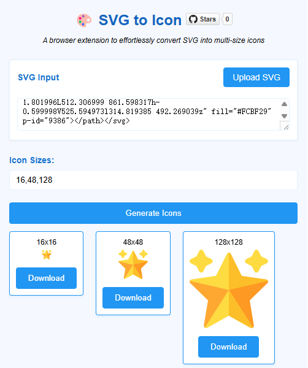
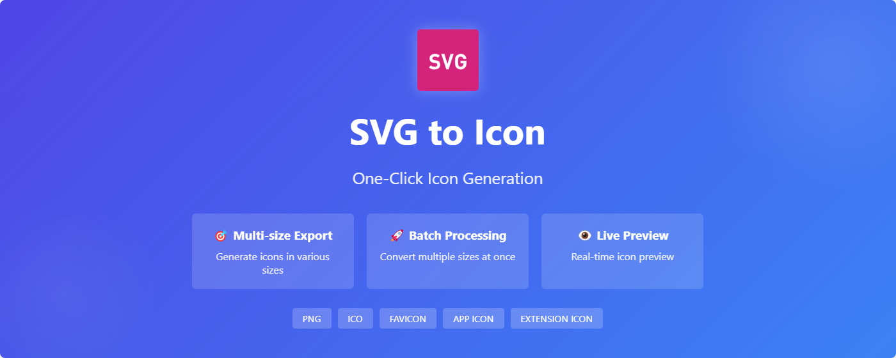

  <h1>🎨 SVG to Icon</h1>
  
<em>A browser extension to effortlessly convert SVG into multi-size icons</em>

  

    
    
  

  <a href="#readme">English</a> | <a href="readme_zh.md">中文</a>

   

## 💻 Interface

## ✨ Features

- 🚀 Quick SVG to multi-size icon conversion
- 📦 Batch size generation support
- 🎯 Real-time preview
- 💾 One-click download for all sizes
- 🌐 Support for major browsers

## 📥 Installation

### Download
Get the latest version from:
- [Chrome Web Store](https://chrome.google.com/webstore/detail/svg-to-icon/eeciepimabplbolbjbpellekfbljhbgk) (Recommended)
- [GitHub Releases](https://github.com/your-username/svg-to-icon/releases/latest):
  - Chrome/Edge users: Download `svg-to-icon-chrome-v*.zip`
  - Firefox users: Download `svg-to-icon-firefox-v*.zip`

### Installation Steps

Chrome / Edge

1. Extract the downloaded `svg-to-icon-chrome-v*.zip`
2. Navigate to `chrome://extensions` in your browser
3. Enable "Developer mode" in the top right
4. Click "Load unpacked"
5. Select the extracted folder

Firefox

1. Navigate to `about:debugging` in Firefox
2. Click "This Firefox"
3. Click "Load Temporary Add-on"
4. Select the downloaded `svg-to-icon-{version}-firefox.zip`

## 🚀 How to Use

1. Click the extension icon in your browser toolbar
2. Paste SVG code or upload an SVG file
3. Enter desired icon sizes (comma-separated)
4. Click "Generate Icons"
5. Preview and download the generated icons

## 🎯 Use Cases

- Developers creating app icons
- Designers exporting multi-size icons
- UI/UX design system maintenance
- Website favicon generation

## 🛠️ Development

### Prerequisites
- Node.js 18+
- npm or yarn

### Setup