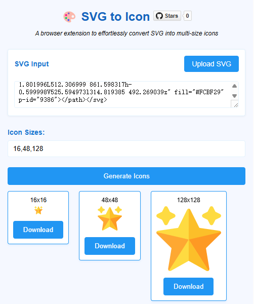

  <h1>🎨 SVG to Icon</h1>
  
<em>轻松将 SVG 转换为多尺寸图标的浏览器扩展</em>

  

    
    
  

## 💻 界面

## ✨ 特性

- 🚀 快速转换 SVG 为多尺寸图标
- 📦 支持批量尺寸生成
- 🎯 实时预览转换效果
- 💾 一键下载所有尺寸图标
- 🌐 支持主流浏览器

## 📥 安装

### 下载
从 [GitHub Releases](https://github.com/your-username/svg-to-icon/releases/latest) 页面下载最新版本：
- Chrome/Edge 用户：下载 `svg-to-icon-chrome-v*.zip`
- Firefox 用户：下载 `svg-to-icon-firefox-v*.zip`

### 安装步骤

Chrome / Edge

1. 解压下载的 `svg-to-icon-{version}-chromium.zip`
2. 在浏览器地址栏输入 `chrome://extensions`
3. 开启右上角的"开发者模式"
4. 点击"加载已解压的扩展程序"
5. 选择解压后的文件夹

Firefox

1. 在浏览器地址栏输入 `about:debugging`
2. 点击"此 Firefox"
3. 点击"临时载入附加组件"
4. 选择下载的 `svg-to-icon-{version}-firefox.zip`

## 🚀 使用方法

1. 点击浏览器工具栏中的扩展图标
2. 粘贴 SVG 代码或上传 SVG 文件
3. 输入需要的图标尺寸（用逗号分隔）
4. 点击"生成图标"
5. 预览并下载生成的图标

## 🎯 使用场景

- 开发者制作应用图标
- 设计师导出多尺寸图标
- UI/UX 设计系统维护
- 网站 favicon 生成

## 🤝 贡献

欢迎提交 Issue 和 Pull Request！

## 📄 许可

[MIT License](LICENSE) © 2024 Your Name